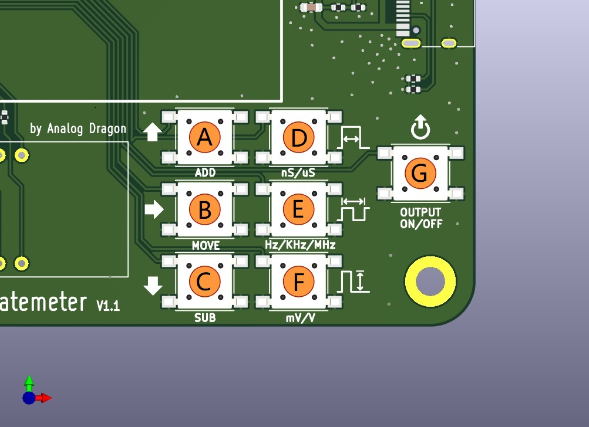
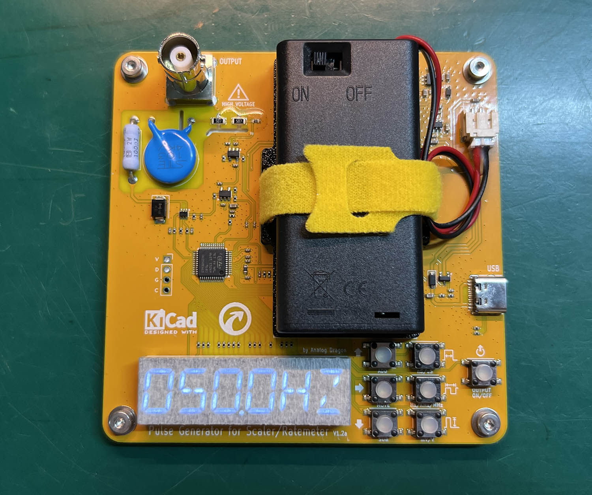
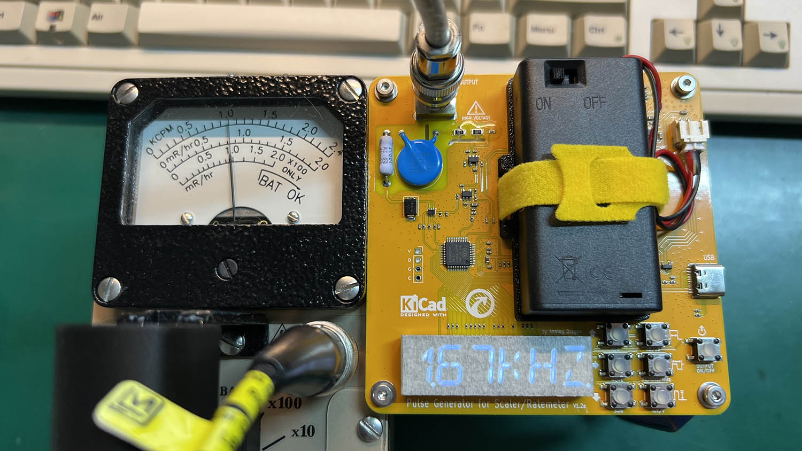
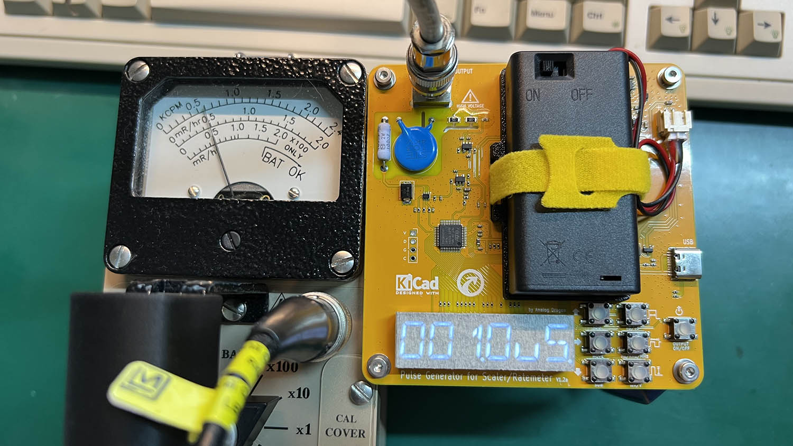

**脉冲发生器**  
  
用于测试校准率表或定标器等剂量率仪器。stm32g0，kicad。  
  
制作这个是因为购入了一台LUDLUM Model 3与Model 2360，需要校准它们的多个阈值，所以做一个小工具。  
  
功能：  
- 1、产生2mV\~1000mV、50nS\~500uS、频率可调，正负可调的脉冲,用来校准或验证性能；  
- 2、多种模式；  
- 3、输出接口改为MHV接口（之前的劣质BNC会击穿失效）；  
- 4、支持USB供电与电池供电，USB接入时自动断开电池；  
  
## 按键  

  

**按键功能描述**  
  
- A：**加** 按键，当有数字的某位选中时，按下可以+1S；  
- B：**切换/模式** 按键，**短按**可以切换选择数字的位置，**长按**可以切换**模式**（详见[模式](#模式)）。  
- C：**减** 按键，当有数字的某位选中时，按下可以-1S；  
- D：**脉宽** 按键，短按设置，长按切换倍率。范围500uS\~50nS，最小分步进50nS，有效数字4位；  
- E：**频率** 按键，短按设置，长按切换倍率。范围5MHz\~0.1Hz，有效数字3或4位；  
- F：**电压** 按键，短按设置，长按切换**输出脉冲电压**或**输入高压值**；  
- G：**输出** 按键，按下开始输出所设置的脉冲；  

***其他用法***  
- A+B： 切换输出脉冲极性为 **正极性** 脉冲（显示POS_┌┐_）  
- C+B： 切换输出脉冲极性为 **负极性** 脉冲（显示NEG‾└┘‾）  
  
***校准高压***  
进入方法：开机过程中，按住F+B：进入校准模式。  
  
默认单点校准，可按D/E/F键，切换校准点数为1/3/5。（V1.2更新）  
校准时，将屏幕显示的电压调整到与输入电压一致时，保持电压不变，长按**输出**按键（G键），将会保存校准点。  
保存的校准点数量满足后会自动结束校准，结果显示`DONE`则说明校准成功。显示`FAILED RETRY`说明失败。  
  
校准失败可能的原因：  
- 校准点之间的电压小于100V，比如说点1为100V，点2为150V；  
- 校准时无输入电压；  
- 输入的电压与显示电压不相关；  
  
## 模式  
  
支持三种模式  
  
- 一般模式（`NORMAL MODE`）：设置的参数会输出**持续**的脉冲，输出时显示面板的右下角会有灯快速闪烁代表状态；  
- 持续脉冲模式（`REPEAT BURST`）：设置的参数会以**100CPS**输出；  
- 单次脉冲模式（`SINGEL BURST`）：设置的参数，每次按下**输出**键，会固定发出**100个脉冲**；  
  

## 原理图  
  
[原理图](./SCH.pdf)  
  
## 实物  
  

## 测试  
- 一般模式 设置 1.67CPS(100KCPM)  
  
  
- 持续脉冲模式 (6KCPM)  
  
  
