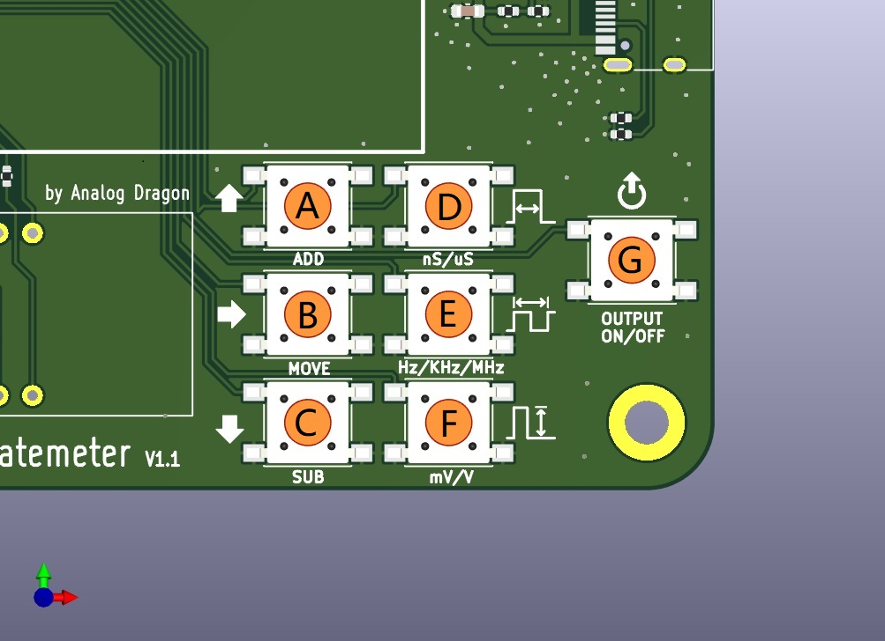

**脉冲发生器**  
  
用于测试盖格计数器或者其他剂量率仪器。stm32g0，kicad。  
  
功能：  
- 1、显示输入的高压电压。  
- 2、产生5mV\~3200mV、500uS\~50nS、频率可调的脉冲,用来校准率表或者验证定标器的性能。  
- 3、多种模式  
  
## 按键  

  

**按键功能描述**  
  
- A：加 按键，当有数字的某位选中时，按下可以+1S；  
- B：切换/模式 按键，短按可以切换选择数字的位置，长按可以切换模式（详见[模式](#模式)）。  
- C：减 按键，当有数字的某位选中时，按下可以-1S；  
- D：脉宽 按键，短按设置，长按切换倍率。范围500uS\~50nS，最小分步进50nS，有效数字4位；  
- E：频率 按键，短按设置，长按切换倍率。范围5MHz\~0.1Hz，有效数字3或4位；  
- F：电压 按键，短按设置，长按切换输出脉冲电压或输入高压值；  
- G：输出 按键，按下开始输出所设置的脉冲；  

***其他用法***  
- A+B： 切换输出脉冲极性为 **正极性** 脉冲  
- C+B： 切换输出脉冲极性为 **负极性** 脉冲  
  
***校准高压斜率***  
  
开机过程中，按住F+B：进入校准模式，将屏幕显示的电压调整到与输入电压一致时，保持电压不变，长按**输出**按键，将会保存校准值并退出。  
值得注意的是，因为只有一点校准，误差会很大(显示值的±5\~10V)，后续可能会更新多点校准。  
  
## 模式  
  
支持三种模式  
  
- 一般模式（NORMAL MODE）：设置的参数会输出持续的脉冲，输出时显示面板的右下角会有灯快速闪烁代表状态；  
- 持续脉冲模式（REPEAT BURST）：设置的参数会以**100CPS**输出，（每秒一组，每组100个脉冲，因为软件问题可能会识别为101个脉冲，是因为关闭寄存器的时候不彻底）；  
- 单次脉冲模式（SINGEL BURST）：设置的参数，每次按下**输出**键，会固定发出100个脉冲（也是同样的软件问题，可能会识别为101个脉冲）；  
  
  